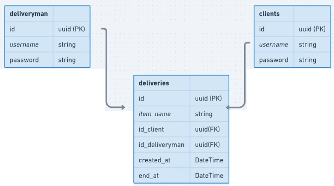

# Back-End de Entregas

## Modelo

## 1 Estrutura do projeto

### Boas vindas

### Criando estrutura do projeto

- Dependências
- Typescript
- bcrypt
- JsonWebToken
- Express
- ts-node-dev

- yarn tsc --init
  [Instruções tsconfig](https://www.prisma.io/docs/getting-started/setup-prisma/start-from-scratch/relational-databases-typescript-postgres#create-project-setup)

## 2 Criando estrutura de tabelas

### Criando estrutura de tabelas

- yarn prisma init
- yarn prisma migrate dev
- psql -h localhost -U postgres
- docker container run --name delivery -p 5432:5432 -e POSTGRES_PASSWORD=admin -e POSTGRES_USER=admin -e POSTGRES_DB=mydb -d postgres
- docker exec -it delivery bash
- psql -h localhost -U admin -W
- \l
- \c mydb
- \d

### Criando o server com express

## 3 Cliente

### Cadastro de cliente

### Criar autenticação do cliente

### Tratando as exceções

## 4 Entregador

### Cadastro de deliveryman

### Criar autenticação do deliveryman

## 5 Entregas

### Cadastro de entregas

### Middleware de cliente autenticado

### Busca de entregas sem deliveryman atrelado

### Middleware de deliveryman autenticado

### Update de entrega adicionando entregador

### Busca de entregas utilizando o token do cliente

### Busca com select

### Busca entregas do entregador

### Atualização de entrega com a data da entrega

### Recap
